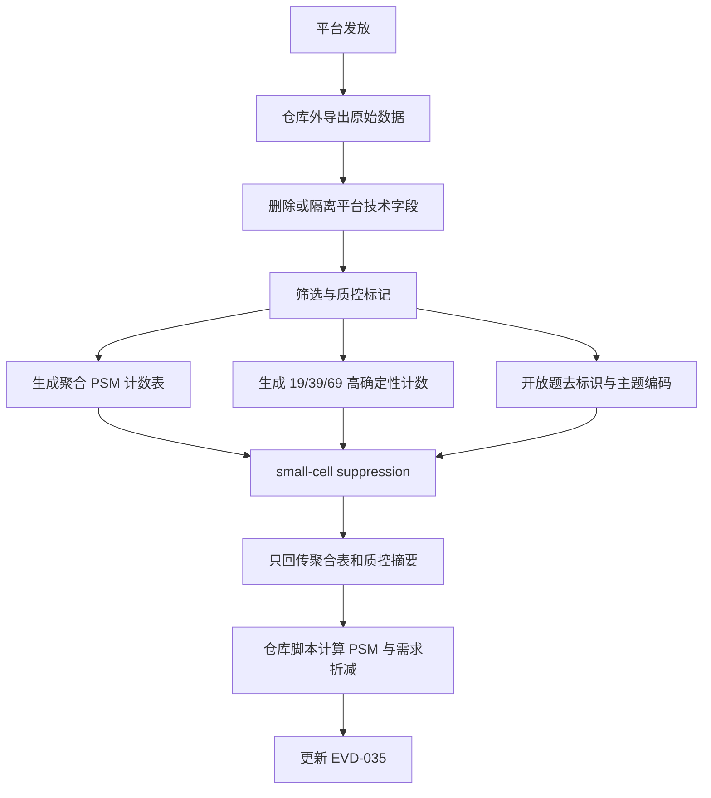

# RES-003-WTP 问卷发放执行包

版本：2026-07-12

用途：交给问卷平台或外部执行人员，用于录入、发放、质控和回传 [RES-003-WTP](RES-003-WTP-pricing-experiment.md) 的中国家长 WTP 定价问卷。本文是执行入口；问卷正文以 [RES-003-WTP-questionnaire](RES-003-WTP-questionnaire.md) 为准，分析口径以 [RES-003-WTP-analysis-tables](RES-003-WTP-analysis-tables.md) 为准。

## 执行边界

| 项目 | 要求 |
| --- | --- |
| 研究对象 | 中国 4-8 岁儿童家长或主要教育支出决策者 |
| 有效样本 | 主分析有效样本 n >= 200；预算允许时目标 n = 300 |
| 问卷时长 | 5-7 分钟 |
| 发放设备 | 移动端优先，提交前需完成移动端预览 |
| 数据回传 | 只回传聚合表、质控摘要和去标识主题编码 |
| 禁止入库 | 原始问卷导出、清洗后个体级数据、IP、设备指纹、精确渠道链接、开放题原文 |
| 研究限制 | 本研究不测试真实支付，不代表产品已完成，不授权 MVP |

执行人员不得修改产品概念卡中的未验证、安全边界和非承诺提示。不得在招募文案、问卷标题或结束页中暗示产品已经上市、效果已经验证、即将销售或问卷将决定产品开发。

## 文件清单

| 文件 | 给谁用 | 用途 |
| --- | --- | --- |
| [RES-003-WTP-questionnaire](RES-003-WTP-questionnaire.md) | 问卷平台录入人员 | 逐题录入文本、选项、跳转和字段名 |
| [RES-003-WTP-analysis-tables](RES-003-WTP-analysis-tables.md) | 数据分析人员 | 字段字典、清洗标记、聚合表结构和 PSM 计算口径 |
| [RES-003-WTP-launch-checklist](RES-003-WTP-launch-checklist.md) | 项目执行负责人 | 发放前、仓库外清洗、聚合回流和停止条件 |
| [RES-003-WTP-psm-distribution-template.csv](RES-003-WTP-psm-distribution-template.csv) | 数据分析人员 | 聚合 PSM 计数回填模板 |
| [RES-003-WTP-demand-scenario-template.csv](RES-003-WTP-demand-scenario-template.csv) | 数据分析人员 | 19/39/69 元高确定性样本回填模板 |
| [EVD-035 pending scaffold](../evidence/EVD-035-china-parent-wtp-pricing-experiment.md) | 研究负责人 | 真实聚合结果产生后的证据记录框架 |

## 平台设置

| 设置项 | 平台配置 |
| --- | --- |
| 必答题 | Q0-Q20 必答；Q21-Q22 选填 |
| 多选限制 | Q17 最多 3 项；Q19 最多 3 项 |
| 随机化 | Q19 选项随机展示；Q20 使用同一组选项但无需随机 |
| 退出逻辑 | Q0=B 结束；Q1=C 结束；Q2 仅选 C 结束 |
| 理解检查 | Q6-Q8 不做即时提示正确答案；后处理标记失败样本 |
| 作答时长 | 保留总时长用于仓库外质控；低于 120 秒标记低时长 |
| 重复样本 | 平台可做重复提交识别；重复识别字段不得进入仓库 |
| 技术字段 | 关闭 IP、精确地理位置和不必要设备指纹采集；无法关闭时仅仓库外删除 |
| 开放题 | 添加“不填写姓名、联系方式、学校、具体地点或家庭可识别信息”提示 |
| 导出字段名 | 使用本文和问卷正文中的英文 `field_name` |

## 招募与配额

至少使用两个非重合招募渠道。每个渠道只记录类型，不记录具体群名、账号、链接、手机号或邀请人。

| 字段值 | 渠道类型 | 目标 |
| --- | --- | ---: |
| `panel` | 在线问卷样本平台 | 40%-70% |
| `parent_social` | 家长社群或社交媒体 | 10%-40% |
| `edu_parenting_media` | 教育/亲子内容渠道 | 10%-40% |
| `public_research_link` | 研究团队公开招募链接 | 0%-30% |
| `other` | 其他渠道 | <= 20% |
| `unsure` | 不确定 | 记录但不主动扩大 |

建议配额下限：

| 维度 | 最低要求 |
| --- | --- |
| 城市层级 | 一线、新一线、二线、三线及以下均应有样本；任一层级不足 n=30 时只做描述 |
| 儿童年龄 | `age_4_5` 和 `age_6_8` 均应覆盖；同时选择两者时编码为多选，不推断儿童数量 |
| 儿童 App 付费历史 | 当前/过去付费与从未付费均应覆盖 |
| 月度儿童支出 | 至少覆盖 `100_299`、`300_599`、`600_999` 和 `1000_1999` 区间 |

若单一渠道完成样本占比超过 70%，或某关键分层严重缺样，应先补样，不应直接进入结论分析。

## 招募文案

标题：儿童 AI 创作工具价格接受度调研

短文案：

> 我们正在做一项面向 4-8 岁儿童家长的研究，了解家长对儿童 AI 创作陪伴软件的价格接受度和主要顾虑。问卷约 5-7 分钟，不收集姓名、联系方式、学校、具体住址、照片、录音或健康信息。研究只以汇总结果分析。

不得使用以下说法：

- “产品已上线”“即将开售”“限时体验”
- “验证孩子创造力提升”“保证减少短视频依赖”
- “填写后可获得产品资格”“问卷决定是否开发”
- “安全过滤完全可靠”“教育效果已证实”

## 题目录入清单

| 模块 | 题号 | 题型 | 字段名 | 关键配置 |
| --- | --- | --- | --- | --- |
| 开场 | Q0 | 单选 | `consent_continue` | B 结束 |
| 筛选 | Q1 | 单选 | `decision_role` | C 结束 |
| 筛选 | Q2 | 多选 | `child_age_band` | 仅 C 结束 |
| 筛选 | Q3 | 单选 | `city_tier` | 必答 |
| 筛选 | Q4 | 单选 | `monthly_child_spend` | 必答 |
| 筛选 | Q5 | 单选 | `paid_child_app_history` | 必答 |
| 渠道 | Q5a | 单选 | `recruitment_channel` | 不保存具体来源 |
| 理解检查 | Q6 | 单选 | `comprehension_ai_role` | 正确值 `guide` |
| 理解检查 | Q7 | 单选 | `comprehension_parent_view` | 正确值 `summary_boundary` |
| 理解检查 | Q8 | 单选 | `comprehension_product_type` | 正确值 `software` |
| PSM | Q9 | 单选 | `psm_too_cheap` | 价格区间 |
| PSM | Q10 | 单选 | `psm_cheap` | 价格区间 |
| PSM | Q11 | 单选 | `psm_expensive` | 价格区间 |
| PSM | Q12 | 单选 | `psm_too_expensive` | 价格区间 |
| 校准 | Q13 | 1-10 单选 | `concept_interest` | 概念兴趣，不作购买确定性 |
| 校准 | Q14a | 1-10 单选 | `purchase_certainty_19` | 19 元/月 |
| 校准 | Q14b | 1-10 单选 | `purchase_certainty_39` | 39 元/月 |
| 校准 | Q14c | 1-10 单选 | `purchase_certainty_69` | 69 元/月 |
| 行为代理 | Q15 | 单选 | `budget_source` | 必答 |
| 行为代理 | Q16 | 单选 | `expected_retention` | 必答 |
| 信任 | Q17 | 多选 | `trust_requirements` | 最多 3 项 |
| 信任 | Q18 | 1-5 单选 | `ai_trust_level` | 必答 |
| 价值 | Q19 | 多选 | `value_top3` | 最多 3 项；随机展示 |
| 价值 | Q20 | 单选 | `primary_value_driver` | 同 Q19 选项 |
| 开放题 | Q21 | 文本 | `main_concern_text` | 选填；仓库外去标识 |
| 开放题 | Q22 | 文本 | `desired_feature_text` | 选填；仓库外去标识 |

## 选项编码

### 基础字段

| 字段 | 选项编码 |
| --- | --- |
| `decision_role` | A=`primary`，B=`shared`，C=`no` |
| `child_age_band` | A=`age_4_5`，B=`age_6_8`，C=`none` |
| `city_tier` | A=`tier1`，B=`new_tier1`，C=`tier2`，D=`tier3_lower`，E=`unsure` |
| `monthly_child_spend` | A=`0_99`，B=`100_299`，C=`300_599`，D=`600_999`，E=`1000_1999`，F=`2000_plus`，G=`unsure` |
| `paid_child_app_history` | A=`current`，B=`past`，C=`never`，D=`unsure` |
| `recruitment_channel` | A=`panel`，B=`parent_social`，C=`edu_parenting_media`，D=`public_research_link`，E=`other`，F=`unsure` |

### 理解检查字段

| 字段 | 选项编码 |
| --- | --- |
| `comprehension_ai_role` | A=`replace`，B=`guide`，C=`course`，D=`unsure` |
| `comprehension_parent_view` | A=`summary_boundary`，B=`full_transcript`，C=`test_score`，D=`unsure` |
| `comprehension_product_type` | A=`software`，B=`hardware`，C=`offline_course`，D=`unsure` |

### 价格字段

Q9-Q12 使用同一组选项：

| 选项 | 编码 | 标签 |
| --- | --- | --- |
| A | `P00_09` | 0-9 元/月 |
| B | `P10_19` | 10-19 元/月 |
| C | `P20_29` | 20-29 元/月 |
| D | `P30_49` | 30-49 元/月 |
| E | `P50_79` | 50-79 元/月 |
| F | `P80_119` | 80-119 元/月 |
| G | `P120_199` | 120-199 元/月 |
| H | `P200_299` | 200-299 元/月 |
| I | `P300_PLUS` | 300 元/月及以上 |

### 后续行为与价值字段

| 字段 | 选项编码 |
| --- | --- |
| `budget_source` | A=`interest_class`，B=`books_materials`，C=`toys_entertainment`，D=`app_subscription`，E=`new_budget`，F=`would_not_buy`，G=`unsure` |
| `expected_retention` | A=`trial_1m`，B=`2_3m`，C=`4_6m`，D=`7_12m`，E=`12m_plus`，F=`would_not_subscribe`，G=`unsure` |
| `trust_requirements` | A=`privacy_delete`，B=`parent_report`，C=`no_ai_completion`，D=`content_safety`，E=`visible_growth`，F=`expert_endorsement`，G=`low_price`，H=`child_likes`，I=`free_trial`，J=`other` |
| `value_top3` / `primary_value_driver` | A=`start_creation`，B=`richer_expression`，C=`reduce_short_video`，D=`parent_report`，E=`no_ai_completion`，F=`data_control`，G=`weekly_tasks`，H=`portfolio` |

## 质控规则

| 标记字段 | 规则 | 主分析处理 |
| --- | --- | --- |
| `invalid_screening` | Q1=`no`，或 Q2 仅为 `none` | 不计入有效样本 |
| `failed_comprehension` | Q6-Q8 错误或 `unsure` 达到 2 题及以上 | 剔除主分析 |
| `invalid_psm_order` | `psm_too_cheap <= psm_cheap <= psm_expensive <= psm_too_expensive` 不成立 | 剔除主 PSM，保留质量统计 |
| `low_duration` | 总作答时长 < 120 秒 | 人工复核，报告含/不含敏感性 |
| `duplicate_response` | 平台判定重复 | 只保留首个完整样本 |
| `contains_identifier` | 开放题含姓名、联系方式、学校、具体地点、可识别家庭事件 | 仓库内不得保存原文 |

价格顺序判断按价格编码顺序执行：

`P00_09 < P10_19 < P20_29 < P30_49 < P50_79 < P80_119 < P120_199 < P200_299 < P300_PLUS`

## 数据处理流程



原始数据和清洗后个体级数据必须停留在仓库外。若执行方需要共享明细给研究负责人，只能通过仓库外安全渠道，并在完成聚合后删除或归档到受控位置。

## 回传交付物

执行方完成后只回传以下内容：

| 交付物 | 格式 | 最低字段 |
| --- | --- | --- |
| 质控摘要 | CSV/表格 | `total_started`、`total_completed`、`invalid_screening_n`、`failed_comprehension_n`、`invalid_psm_order_n`、`low_duration_n`、`duplicate_response_n`、`contains_identifier_n`、`effective_n_main`、`effective_n_high_certainty_19`、`effective_n_high_certainty_39`、`effective_n_high_certainty_69` |
| 样本结构 | CSV/表格 | `segment_dimension`、`segment_value`、`n`、`pct` |
| PSM 聚合计数 | CSV | `scenario`、`psm_question`、`price_code`、`n` |
| 需求量折减输入 | CSV | `anchor_price_cny`、`effective_n_main`、`high_certainty_n`、`assumed_conversion_rate` |
| 购买确定性分布 | CSV/表格 | `anchor_price_cny`、`score_band`、`n`、`pct` |
| 信任门槛聚合 | CSV/表格 | `requirement`、`n_selected`、`pct_selected`、`rank` |
| 价值主张聚合 | CSV/表格 | `value_driver`、`top3_n`、`top3_pct`、`primary_n`、`primary_pct`、`rank_primary` |
| 开放题主题编码 | CSV/表格 | `source_question`、`theme_code`、`theme_label`、`n_mentions`、`pct_respondents`、`paraphrased_example` |

回传前必须执行隐私发布规则：

- 任一公开或入库单元格 `n < 10` 时合并或抑制。
- 不发布三维及以上交叉表。
- 不发布渠道 + 城市 + 支出 + 年龄的组合表。
- 开放题只保留主题和研究者改写后的概括性 paraphrase，不保留逐字短摘。

## 仓库内计算命令

研究负责人收到聚合表后，在仓库内运行：

```bash
python3 scripts/calculate_wtp_psm.py \
  --psm-input <聚合PSM计数.csv> \
  --price-output <价格点输出.csv> \
  --demand-input <需求量输入.csv> \
  --demand-output <需求量输出.csv>
```

空模板自检命令：

```bash
python3 scripts/calculate_wtp_psm.py \
  --psm-input research/RES-003-WTP-psm-distribution-template.csv \
  --price-output /tmp/res-003-wtp-price-points.csv \
  --demand-input research/RES-003-WTP-demand-scenario-template.csv \
  --demand-output /tmp/res-003-wtp-demand-scenario.csv
```

空模板预期输出：所有价格点为 `no_data`，需求量折减为 0。

## 发放前验收

平台录入完成后，执行负责人必须完成以下验收：

| 验收项 | 通过标准 |
| --- | --- |
| 移动端预览 | 每题显示完整，价格选项和 1-10 分选项不换乱序 |
| 跳转 | Q0、Q1、Q2 退出逻辑正确 |
| 选项限制 | Q17、Q19 最多 3 项 |
| 随机化 | Q19 选项随机展示已开启 |
| 字段名 | 导出字段名与本文一致 |
| 技术字段 | IP、地理位置、设备指纹关闭；无法关闭时有仓库外删除策略 |
| 预测试 | 至少 5 份内部预测试，覆盖退出、低时长、PSM 顺序不一致、开放题提示 |
| 导出测试 | 可导出字段并映射到 [分析字段字典](RES-003-WTP-analysis-tables.md#原始字段字典) |

## 停止条件

出现以下任一情况，应暂停发放或暂停写入 EVD-035：

- 问卷平台无法关闭或删除可识别技术字段。
- 开放题大量出现儿童、家庭、学校或具体地点可识别信息，且无法可靠去标识。
- 有效样本 n < 200。
- 单一渠道占比过高且无法补样。
- 聚合表出现 `n < 10` 单元格且无法合并。
- PSM 曲线无可解释交点，或结论完全依赖 `P300_PLUS` 右删失顶格。
- 目标价格下高确定性样本占比 < 20%。

这些情况不表示研究失败，但会阻止将 EVD-035 写成支持性证据。
